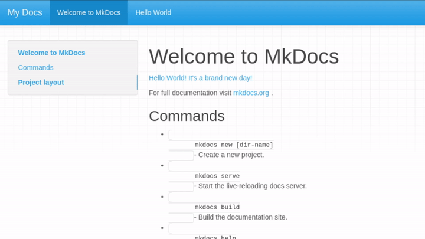

# mkdocs-tooltipster-links-plugin

An MkDocs plugin that adds tooltips to preview the content of page links using tooltipster



## Setup

### Install the Plugin

Install the plugin using pip:

`pip install mkdocs-tooltipster-links-plugin`

Activate the plugin in `mkdocs.yml`:
```yaml
plugins:
  - search
  - tooltipster-links
```

> **Note:** If you have no `plugins` entry in your config file yet, you'll likely also want to add the `search` plugin. MkDocs enables it by default if there is no `plugins` entry set, but now you have to enable it explicitly.

More information about plugins in the [MkDocs documentation][mkdocs-plugins].

### Install Tooltipster

Please reference [Tooltipster's getting started guide](http://iamceege.github.io/tooltipster/#getting-started) for additional installation instructions.

Download Tooltipster and add the css and javascript to `mkdocs.yml`:

```yml
extra_css:
  - css/tooltipster.bundle.min.css

extra_javascript:
  - js/tooltipster.bundle.js  
```

Create custom directory and `main.html` file for overriding the `extra_head` template block

```sh
mkdir theme
touch theme/main.html
```

Add the following to `main.html`:
```html



        <script src="https://ajax.googleapis.com/ajax/libs/jquery/3.4.1/jquery.min.js"></script>
        <script>
                $(document).ready(function() {
                    $('.link-tooltip').tooltipster();
                });
        </script>

```
Add the custom directory to `mkdocs.yml`:
```yml
theme:
  name: mkdocs
  custom_dir: theme
```

Add additonal css to the site (either in a new css file or existing one):
```css
.tooltip_templates { display: none; }
```

## Usage
Once configured property, tooltips-links should create tooltips automagically!

## See Also

More information about templates [here][mkdocs-template].

More information about blocks [here][mkdocs-block].

[mkdocs-plugins]: http://www.mkdocs.org/user-guide/plugins/
[mkdocs-template]: https://www.mkdocs.org/user-guide/custom-themes/#template-variables
[mkdocs-block]: https://www.mkdocs.org/user-guide/styling-your-docs/#overriding-template-blocks
